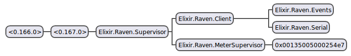

# Raven

**A Client for the [Rainforest Automation Raven USB Stick](https://rainforestautomation.com/rfa-z106-raven/)**

Automatically discover and control all of your [ZigBee SE](http://www.zigbee.org/zigbee-for-developers/applicationstandards/zigbeesmartenergy/) utility meters.

Contact your local utility to see if the Eagle Gateway or Raven USB Stick is compatible with your meter. For [ComEd](https://www.comed.com) in Chicago, you should register your [Raven](https://rainforestautomation.com/rfa-z106-raven/) through the [SMCD](https://www.comed.com/SmartEnergy/ProgramsServices/Pages/SmartMeterConnectedDevices.aspx) as an [Eagle Gateway](https://rainforestautomation.com/rfa-z109-eagle/) as they use the same chipset.

## Use

    1. git clone https://github.com/NationalAssociationOfRealtors/raven.git
    2. mix do deps.get, deps.compile
    3. iex -S mix

## Explanation

The red LED on your Raven should be solid red, no blinking, this indicates it is successfully connected to your meter.

Network debugging messages will appear in `stdout` once every 10 seconds if you have not successfully connected.

    %Raven.Message.NetworkInfo{
        channel: "19",
        coord_mac_id: "0x0000000000000000",
        description: "Successfully Joined",
        device_mac_id: "0x0000000000000000",
        ext_pan_id: "0x000000000000000",
        link_strength: 100,
        short_addr: "0x0000",
        status: "Connected",
        status_code: ""
    }

Once connected you will start to see meter messages every few seconds. By default, most meters will send certain messages periodically. You can view the schedule in the meter process state. Something like this.

    %Raven.Message.ScheduleInfo{
        device_mac_id: "0x00000000000",
        enabled: "Y",
        event: "time",
        frequency: 900,
        meter_mac_id: "0x000000000000"
    }

The different event schedule types are `time`, `price`, `summation`, `message`, `scheduled_prices`, `profile_data`, `demand`

Generally the most interesting is the `InstantaneousDemand` message

    %Raven.Message.InstantaneousDemand{
        demand: 612,
        device_mac_id: "0x00000000000000",
        divisor: 1000,
        kw: 0.612,
        meter_mac_id: "0x00000000000",
        multiplier: 1,
        time_stamp: 525378324
    }

## Architecture

`Raven.Client` is a small Serial client. It is the main interface for sending and receiving messages. As a new meter is discovered a process is spawned through `Raven.MeterSupervisor` and the meter processes state represents the meter attributes.

Every 10 seconds the meter process queries itself for updated state information as well as receiving the messages from the default scheduled events, the state is then broadcast (using notify) over `Raven.Events` event bus. Anyone can add a handler to the event bus to handle updated device state by calling `Raven.EventManager.add_handler`. See `Raven.Handler` for an example implementation of an event handler.

`Raven.Messages` handles all protocol related functions, parsing and creating packets as well as payloads.

In order to communicate with a single meter, in a network that may contain multiple meters you would use the `Raven.Client` interface `Raven.Client.get_demand(meter_pid)` where `meter_pid` is `Raven.Meter.State.id`
